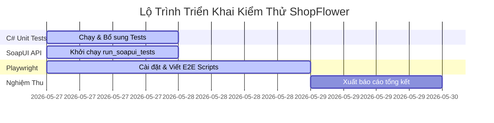

# Kế Hoạch Kiểm Thử Đồng Bộ Hoàn Chỉnh ShopFlower

> [!NOTE]  
> Tài liệu này được xây dựng dựa trên việc phân tích chi tiết dữ liệu từ bảng biểu thiết kế của bạn tại [Google Sheets - Testcase Design](https://docs.google.com/spreadsheets/d/1GYXdiXNb-Nv-ikSSjbkLawuompvvA3NLCtBK2BMbX3s/edit?usp=sharing). 
> Kế hoạch tích hợp các phương pháp kiểm thử hiện đại để nghiệm thu toàn diện các luồng nghiệp vụ lỗi và usecase chính của dự án ShopFlower.

---

## 1. Phương Pháp Tiếp Cận Theo Từng Module (Module-by-Module Testing Strategy)

Chúng ta chia dự án ra làm 5 phân hệ cốt lõi dựa trên danh sách ca kiểm thử của bạn:

```
                          [HỆ THỐNG KIỂM THỨ SHOPFLOWER]
  ┌──────────────────┬──────────────────┼─────────────────┬──────────────────┐
  │                  │                  │                 │                  │
  ▼                  ▼                  ▼                 ▼                  ▼
[Đăng Ký]       [Đăng Nhập]        [Chi Tiết SP]     [Giỏ Hàng &]       [An Toàn &]
                                                     [Thanh Toán]       [Bảo Mật]
```

---

## 2. Kịch Bản Kiểm Thử Chi Tiết Từng Phân Hệ (Test Suite Tailored Matrix)

### 📋 2.1. Module: Đăng Ký Tài Khoản (Register)
Đảm bảo tính đồng bộ dữ liệu giữa Front-end, API, và Ràng buộc CSDL (CDM).

| Mã Test Case | Kịch Bản Kiểm Thử | Các Bước Thực Hiện | Kết Quả Mong Đợi (Assertions) |
| :--- | :--- | :--- | :--- |
| **REG_01** | Đăng ký thông thường thành công | Cung cấp thông tin hợp lệ: Tên ĐN, Email, Tên HT, Mật khẩu. | Tài khoản lưu vào bảng `TAIKHOAN` trong CSDL với `MatKhauHash` và `Salt` được mã hóa PBKDF2. |
| **REG_02** | Đăng ký trùng Tên đăng nhập | Nhập Tên đăng nhập `admin` đã tồn tại trong CSDL. | Hệ thống chặn và hiển thị lỗi validation: *"Tên đăng nhập đã tồn tại"*. Không ghi vào DB. |
| **REG_03** | Đăng ký với Email sai định dạng | Nhập Email dạng `user01gmail.com` hoặc `user01@.com`. | Front-end chặn gửi request và báo lỗi: *"Email không hợp lệ"*. |
| **REG_04** | Đăng ký với Tên hiển thị quá dài | Nhập Tên hiển thị dài 257 ký tự (vượt quá giới hạn NVARCHAR(256)). | Hệ thống chặn lưu vào DB nhằm tránh lỗi tràn bộ đệm hoặc lỗi CSDL. |
| **REG_05** | Tự động làm sạch dữ liệu (Trim) | Nhập tên đăng nhập có khoảng trắng ở đầu/cuối (ví dụ: `  user_03  `). | DB lưu dữ liệu sạch đã được trim: `user_03`. |

---

### 🔑 2.2. Module: Đăng Nhập Hệ Thống (Login)
Xác thực cơ chế an toàn và chống tấn công Brute Force.

| Mã Test Case | Kịch Bản Kiểm Thử | Các Bước Thực Hiện | Kết Quả Mong Đợi (Assertions) |
| :--- | :--- | :--- | :--- |
| **LOG_01** | Đăng nhập với tài khoản bị khóa | Cố gắng đăng nhập tài khoản có `IsActive = false` trong CSDL. | Đăng nhập thất bại. Hiển thị thông báo: *"Tài khoản đã bị vô hiệu hóa"*. |
| **LOG_02** | Đăng nhập tài khoản chưa tồn tại | Nhập tên đăng nhập `user_unknown` không có trong DB. | Hệ thống báo lỗi bảo mật chung chung: *"Tên đăng nhập hoặc mật khẩu không đúng"*. |
| **LOG_03** | Ẩn/Hiện mật khẩu nhập vào | Nhập mật khẩu. Nhấp vào icon hình mắt để xem. | Mặc định mật khẩu bị che dưới dạng dấu chấm. Khi nhấn xem, văn bản hiển thị rõ ràng. |
| **LOG_04** | Giới hạn Brute Force | Nhập sai mật khẩu liên tục quá 5 lần trên cùng một tài khoản. | Hệ thống tạm khóa tài khoản hoặc kích hoạt yêu cầu nhập Captcha bảo vệ. |
| **LOG_05** | Kiểm tra Session Timeout | Để trình duyệt không tương tác vượt quá thời gian timeout thiết lập. | Hệ thống tự động xóa Token/Session cũ, điều hướng về màn hình đăng nhập. |

---

### 💐 2.3. Module: Chi Tiết Sản Phẩm & Giỏ Hàng (Product Detail & Cart)
Kiểm soát chặt chẽ ràng buộc số lượng đặt hàng trước khi đưa vào giỏ.

| Mã Test Case | Kịch Bản Kiểm Thử | Các Bước Thực Hiện | Kết Quả Mong Đợi (Assertions) |
| :--- | :--- | :--- | :--- |
| **DET_01** | Kiểm tra validate số lượng biên dưới | Nhập số lượng đặt mua là `0` hoặc `-1` tại trang chi tiết. | Nút giảm số lượng bị vô hiệu hóa khi mốc số lượng bằng 1. Nếu tự gõ tay, báo lỗi *"Số lượng tối thiểu là 1"*. |
| **DET_02** | Kiểm tra validate kiểu dữ liệu | Nhập số lượng dạng chữ (`abc`), ký tự đặc biệt (`@#$`), hoặc số thập phân (`1.5`). | Ô nhập liệu tự động từ chối nhận ký tự lạ hoặc hiển thị cảnh báo lỗi dữ liệu. |
| **DET_03** | Thêm sản phẩm hết hàng | Chọn sản phẩm có `SoLuongTon = 0` trong DB. | Giao diện hiển thị nhãn *"Hết hàng"*. Nút "Thêm vào giỏ" bị vô hiệu hóa (disabled). |
| **DET_04** | Zoom và Tải hình ảnh sản phẩm | Di chuột vào ảnh sản phẩm có độ phân giải cao hoặc mô phỏng lỗi tải ảnh. | Ảnh được zoom chi tiết to rõ nét. Nếu ảnh lỗi, hiển thị ảnh thay thế (placeholder) cùng mô tả thuộc tính `alt`. |

---

### 🛒 2.4. Module: Giỏ Hàng & Thanh Toán (Cart & Checkout)
Kiểm tra độ toàn vẹn của dữ liệu đặt hàng.

| Mã Test Case | Kịch Bản Kiểm Thử | Các Bước Thực Hiện | Kết Quả Mong Đợi (Assertions) |
| :--- | :--- | :--- | :--- |
| **PAY_01** | Kiểm thử Validate Textbox giao diện | Để trống các trường bắt buộc và nhấn ĐẶT HÀNG. | Kích hoạt hiệu ứng viền đỏ `is-invalid`, xuất hiện thông báo trượt nhẹ xuống và tự động cuộn màn hình tập trung vào ô lỗi đầu tiên. |
| **PAY_02** | Kiểm tra hiển thị định dạng tiền tệ | Xem tổng giá đơn hàng tại Sidebar. | Giá tiền hiển thị chuẩn phân tách hàng nghìn (ví dụ: `1,500,000đ` hoặc `1.500.000 VNĐ`). |
| **PAY_03** | Đặt hàng trực tiếp không qua giỏ | Truy cập thẳng URL thanh toán bằng API Bypass. | Hệ thống kiểm soát rủi ro, chuyển hướng an toàn hoặc cho phép mua trực tiếp từ trang chi tiết sản phẩm. |

---

### 🛡️ 2.5. Module: An Toàn & Bảo Mật (Security Testing)
Đảm bảo CSDL được bảo vệ tuyệt đối trước các truy vấn phá hoại từ bên ngoài.

| Mã Test Case | Kịch Bản Kiểm Thử | Các Bước Thực Hiện | Kết Quả Mong Đợi (Assertions) |
| :--- | :--- | :--- | :--- |
| **SEC_01** | Kiểm thử tấn công SQL Injection | Nhập chuỗi `' OR '1'='1` vào ô Tên đăng nhập hoặc Tìm kiếm sản phẩm. | Hệ thống sử dụng Parameterized Query để xử lý chuỗi nhập vào như một văn bản thường, ngăn chặn việc bypass SQL. Không gây ra lỗi 500. |

---

### 👑 2.6. Module: Quản Trị Hệ Thống (Admin Management)
Xác thực vai trò và phân quyền (Role-based Access Control) cùng các nghiệp vụ quản trị CRUD.

| Mã Test Case | Kịch Bản Kiểm Thử | Các Bước Thực Hiện | Kết Quả Mong Đợi (Assertions) |
| :--- | :--- | :--- | :--- |
| **ADM_01** | Kiểm tra phân quyền truy cập trang Admin | Đăng nhập tài khoản vai trò `User` và cố gắng truy cập `/Admin/Dashboard`. | Hệ thống tự động chặn và chuyển hướng người dùng sang trang thông báo lỗi truy cập trái phép (`Unauthorized.cshtml`). |
| **ADM_02** | Ràng buộc biên giá bán khi CRUD | Thêm mới sản phẩm có `GiaBan <= 0` hoặc giá hiển thị sai định dạng. | Hệ thống chặn và hiển thị lỗi: *"Giá bán phải lớn hơn 0"*. Không lưu vào CSDL. |
| **ADM_03** | Quy trình phê duyệt Hóa đơn | Thay đổi trạng thái đơn hàng từ `Pending` -> `Completed` -> `Cancelled`. | CSDL cập nhật đúng thuộc tính trạng thái hóa đơn. Không phát sinh lỗi khóa ngoại hay xung đột dữ liệu. |
| **ADM_04** | Xóa tài khoản khách hàng an toàn | Admin thực hiện xóa tài khoản đã có lịch sử đặt hàng. | Hệ thống gọi stored procedure `sp_XoaTaiKhoanAnToan`, thực hiện ẩn tài khoản (soft-delete) hoặc xóa an toàn, chặn việc xóa cứng gây lỗi khóa ngoại. |

---

### 📝 2.7. Phân Hệ Thông Tin Cá Nhân & Tin Tức (Profile & News)
Kiểm tra tính năng cập nhật hồ sơ cá nhân và quản lý nội dung bài viết.

| Mã Test Case | Kịch Bản Kiểm Thử | Các Bước Thực Hiện | Kết Quả Mong Đợi (Assertions) |
| :--- | :--- | :--- | :--- |
| **PRF_01** | Cập nhật hồ sơ cá nhân | Thay đổi thông tin cá nhân (Tên hiển thị, Email, Số điện thoại). | CSDL lưu thông tin mới chính xác. Thực hiện dọn dẹp các ký tự khoảng trắng thừa trước khi cập nhật. |
| **NWS_01** | Thêm mới tin tức/bài viết | Admin tạo bài viết mới có ảnh và phần thân bài viết. | Bài viết được lưu vào bảng `TINTUC` thành công. Hiển thị đúng trên giao diện tin tức Front-end. |

---

## 3. Lộ Trình Thực Hiện Kiểm Thử Chi Tiết (Testing Roadmap)

Để thực hiện kiểm thử trơn chu dự án này, chúng ta cần tuân thủ 4 bước hành động cụ thể sau:



### 🏃‍♂️ Bước 1: Kích hoạt Unit Test C# Backend
*   **Mục tiêu:** Chạy bộ test `PasswordHashingTests.cs` mà chúng ta vừa tích hợp vào `ShopFlower.Tests`.
*   **Hành động:** 
    ```bash
    dotnet test ShopFlower.Tests\ShopFlower.Tests.csproj --no-build
    ```

### 🔌 Bước 2: Chạy API TestSuite trên SoapUI
*   **Mục tiêu:** Kiểm tra độ toàn vẹn của 6 API Controllers (Register, Login, SanPham, HoaDon).
*   **Hành động:** Chạy tệp tin [run_soapui_tests.bat](file:///C:/code/CNPM/Nhom6_ST5-Ca2/Shop-Flower/run_soapui_tests.bat) để xuất báo cáo kiểm thử tự động ra thư mục `SoapUI_Reports`.

### 🎭 Bước 3: Triển khai & Chạy Playwright E2E UI Tests
*   **Mục tiêu:** Tự động hóa trình duyệt Chrome, Edge, Firefox, và Mobile Safari để chạy kịch bản đặt hàng thực tế trên trang thanh toán.
*   **Hành động:** Thực hiện theo các hướng dẫn trong [multi_platform_testing_plan.md](file:///C:/Users/LUAN/.gemini/antigravity-cli/brain/86ac641a-5fe8-480f-930c-b44fc7b8f33c/multi_platform_testing_plan.md).

### 📝 Bước 4: Nghiệm thu thủ công (Manual Verification)
*   Thực hiện các kịch bản kiểm thử biên lượng tồn kho (`DET_01`, `DET_02`) trực tiếp trên trình duyệt giao diện admin/user để đánh giá trải nghiệm UI/UX.
